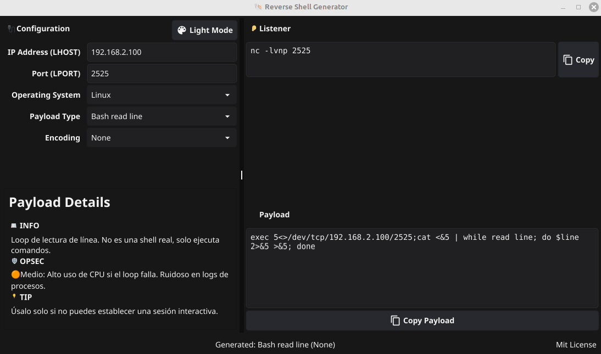

# 🐚 Go Reverse Shell Generator


A powerful, standalone desktop application for generating reverse shell payloads. Rewritten in **Go (Golang)** using the **Fyne** toolkit, this tool is designed for penetration testers, Red Teamers, and CTF players who need a reliable, offline payload generator.

It serves as a compiled, portable alternative to online tools like [revshells.com](https://revshells.com), with zero runtime dependencies (no Python required on the host).

---


*(Save a screenshot of your app as screenshot.png)*

---

## ✨ Key Features

| Feature | Description |
|---------|-------------|
| 🚀 **Portable Binary** | Compiles to a single executable (`.exe` or binary). Carry it on a USB; runs instantly. |
| 🌓 **Dark/Light Mode** | Includes a toggle button to switch themes. Defaults to Dark Mode for late-night hacking. |
| 📚 **Smart Metadata** | **New:** Integrated help panel showing **OPSEC warnings**, requirements, and usage tips for each payload. |
| ⚡ **Real-Time Gen** | Payloads and Listeners update instantly as you type the IP/Port. |
| 🔐 **Encodings** | Bypass WAFs with **Base64**, **URL**, and **Double URL** encoding options. |
| 📋 **One-Click Copy** | Dedicated buttons for copying the `nc` listener and the payload payload to clipboard. |
| 🛡️ **Cross-Platform** | Logic separated into OS-specific files to ensure smooth compilation on any system. |

---

## 🎯 Supported Payloads Library

The tool includes a curated list of modern and classic vectors:

### 🐧 Linux / Unix / Web
*   **Bash:** Classic `-i`, generic TCP, UDP, file descriptor variants (196, 5).
*   **Netcat:** `mkfifo`, `-e`, `-c`, `ncat` SSL.
*   **Web Shells:** PHP (PentestMonkey, `system`, `exec`), JSP, ASPX.
*   **Scripting:** Python (2/3), Perl, Ruby, NodeJS, Lua.
*   **Compiled/Misc:** Golang, Socat (TTY), OpenSSL, Awk, Telnet.

### 🪟 Windows
*   **PowerShell:** TCP Stream, Base64 Encoded, IEX (DownloadString), ConPtyShell (Fully Interactive).
*   **Binaries:** `nc.exe`, `ncat.exe`.
*   **Living off the Land:** MSBuild, Mshta, Regsvr32.
*   **C# / .NET:** TCP Client, Process injection.

---

## 📦 Installation & Build

### Prerequisites
1.  **Go 1.20+**: [Download Go](https://go.dev/dl/)
2.  **C Compiler (GCC)**: Required by Fyne for GPU interface bindings.
    *   **Linux (Debian/Ubuntu):** `sudo apt install gcc libgl1-mesa-dev xorg-dev`
    *   **Windows:** Install [TDM-GCC](https://jmeubank.github.io/tdm-gcc/).

### 1. Clone & Init
```bash
git clone https://github.com/YOUR_USERNAME/go-revshell.git
cd go-revshell
go mod tidy
```

### 2. Build for Linux/macOS
```bash
go build -o revshell-gen .
```

### 3. Build for Windows
To build a Windows `.exe` that hides the console window on startup:
```bash
go build -ldflags -H=windowsgui -o revshell-gen.exe .
```

---

## 💻 Usage

1.  **Launch:** Run the compiled binary.
2.  **Config:**
    *   **LHOST:** Enter your attacking IP (VPN/Tun0).
    *   **LPORT:** Enter the listening port.
3.  **Selection:**
    *   Choose Target OS (Linux/Windows).
    *   Select the Payload strategy.
    *   *Check the "Payload Details" panel for OPSEC warnings.*
4.  **Encode (Optional):** Select Base64 if you are injecting into a filtered input.
5.  **Execute:**
    *   Copy & Run the **Listener**.
    *   Copy & Inject the **Payload**.

---

## 📁 Project Structure

The project is structured to allow cross-compilation without OS-tag conflicts:

```text
go-revshell/
├── main.go             # GUI Logic, Event Handling, Encoding
├── metadata.go         # Help text, Tips, and OPSEC info database
├── payloads_lin.go     # Map of Linux/Unix payloads
├── payloads_win.go     # Map of Windows payloads
├── go.mod              # Go module definition
└── README.md           # Documentation
```

---

## 🤝 Contributing

Contributions are welcome! To add a new shell:

1.  **Add the Code:** Open `payloads_lin.go` or `payloads_win.go` and add the string to the map.
2.  **Add the Help:** Open `metadata.go` and add the description, stability info, and tips.
3.  **Pull Request:** Submit your changes!

### Example (metadata.go):
```go
"MyNewShell": {
    Description: "Uses a specific binary...",
    OpSec:       "🟢 Stealthy",
    Consejo:     "Use port 443 to blend in.",
},
```

---

## ⚠️ Legal Disclaimer

```text
THIS SOFTWARE IS PROVIDED FOR EDUCATIONAL USE AND AUTHORIZED SECURITY ASSESSMENTS ONLY.

1. Do not use this tool on systems you do not own or have explicit permission to test.
2. The authors are not responsible for any damage or illegal use.
3. Misuse of this software violates local and international laws.
```

---

## 📄 License

Distributed under the **MIT License**.
